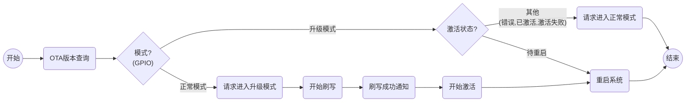
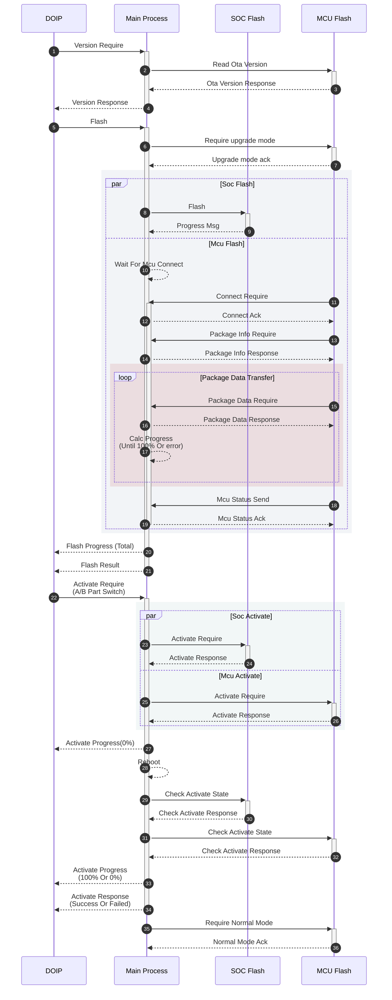

# 一体机MCU刷写与SOC通信协议

[TOC]

*变更记录表*

| 版本 | 日期       | 作者   | 修改说明            |
|:-----|:-----------|:-------|:--------------------|
| 1.0  | 2023-06-16 | 杨维才 | 新建 : 协议定义     |
| 1.1  | 2023-06-19 | 杨维才 | 增加 : 通讯时序图   |
| 1.2  | 2023-07-14 | 杨维才 | 修改 : 修改协议定义 |
| 1.3  | 2023-07-18 | 杨维才 | 修改 : 更正协议错误 |
| 1.4  | 2024-07-25 | 杨维才 | 修改 : 修改主流程图 |
| 1.5  | 2024-08-01 | 杨维才 | 修改 : 修改协议错误 |

## 一、地平线SPI协议定义

```c
为兼容之前的以读写系统设备通道为背景的通信方式，当前的地平线SPI接口中需要增加协议定义。
之前的通信使用三个通道通信且每个通道的业务协议header标志信息可能重合。三个通道分别为：

1. /dev/spi_ch0: 控制指令协议      (PROTO_OTA_CTL_CMD)
2. /dev/spi_ch1: 固件传输协议      (PROTO_OTA_PACKAGE)
3. /dev/spi_ch2: OTA版本查询协议   (PROTO_OTA_VER_REQ)

而当前地平线SPI通信协议底层只使用一个通道进行通信，要区分以上三个通道的不同协议格式，
需要对地平线SPI通信协议接口进行修改增加一个消息类型并定义其下属的三个子类型，
分别代表上面三个通道的识别标识信息。

/// 新增SPI接口消息类型 custom protocol for ota
MSG_CUSTOM_PROTO_OTA_SOC = 0x3FFF  /// SOC->MCU
MSG_CUSTOM_PROTO_OTA_MCU = 0x2FFF  /// MCU->SOC

/// @brief 子类型 sub fucntion of MSG_CUSTOM_PROTO_OTA
enum {
    SUBFUNC_CUSTOM_PROTO_OTA_CTL_CMD = 0x0701,
    SUBFUNC_CUSTOM_PROTO_OTA_PACKAGE = 0x0702,
    SUBFUNC_CUSTOM_PROTO_OTA_VER_REQ = 0x0703,
};
```

协议帧定义(最大长度4096)：

| Header                                                  | Sub Fucntion          | Payload   |
|:--------------------------------------------------------|:----------------------|:----------|
| Type : 2 \| Length : 2 \| Proto Id : 4 \| Timestamp : 8 | Sub : 2 \| Unused : 2 | User Data |

```c
Type = 0x3FFF (or 0x2FFF)
Length = Sub(2) + Unused(2) + Payload长度(max: 4076)
Sub = SUB FUNC (enum值)

SOC与MCU通信发送数据时都使用以上数据格式(详情请参考地平线SPI接口协议文档)。
```

## 二、MCU刷写通信协议

### 1. 控制指令协议 (CTL_CMD)

---

请求 (SOC -> MCU)：

```c
Ctl_Cmd 控制命令: 
enum ESysCtlCmd {
    SYSTEM_UPGRADE_SUCCESS = 0,      // 升级成功通知
    SYSTEM_UPGRADE_FAIL = 1,         // 升级失败通知
    SYSTEM_RESET_REQ = 3             // 请求系统重启
    SYSTEM_MODE_UPGRADE_REQ = 4      // 请求进入升级模式(拉高GPIO)
    SYSTEM_MODE_NORMAL_REQ = 5       // 请求进入正常模式(拉低GPIO)
    SYSTEM_UPGRADE_ACTIVATE_REQ = 6  // 激活请求(切分区)
    SYSTEM_ACTIVATE_STATUS_REQ = 7   // 激活状态查询
}
```

| Header                                    | Payload                        |
|:------------------------------------------|:-------------------------------|
| Cmd_Id : 1 \| Reverse : 1 \| Data Len : 2 | Ctrl_Cmd : 4 \| User Data : 24 |

```c
Cmd_Id: 1
Data Len: Payload 长度
Ctl_Cmd: enum ESysCtlCmd 值
User Data: 000...
```

---

响应 (MCU -> SOC):

| Header                                    | Payload                    |
|:------------------------------------------|:---------------------------|
| Cmd_Id : 1 \| Reverse : 1 \| Data Len : 2 | CmdResp : 4 \| Result : 24 |

```c
Cmd_Id: 1
Data Len: Payload 长度
CmdResp : 对应请求中的Ctrl_Cmd
Result  : 执行结果
```

---

### 2. 固件传输协议 (PACKAGE)

对于固件包数据的发送，SOC等待读取MCU的请求，根据请求指令进行数据传输。依次有下面4个通信过程：

```c
<1> connect require (连接请求，握手)
<2> package header require (固件包头信息请求) 
<3> package data require (固件包数据请求)
<4> MCU status response (MCU 处理状态反馈) 
```

```c
Cmd_Id 定义:
    typedef enum { // 请求 (MCU -> SOC)
        SWDL_CMD_IOC_CONNECT_REQ = 0x01,
        SWDL_CMD_PACK_INFO_REQ = 0x02,
        SWDL_CMD_PACK_DATA_REQ = 0x03,
        SWDL_CMD_IOC_STATUS_SEND = 0x04,
    } Tx_Id_Type;

    typedef enum { // 响应 (SOC -> MCU)     
        SWDL_CMD_IOC_CONNECT_RESP = 0x81,
        SWDL_CMD_PACK_INFO_RESP = 0x82,
        SWDL_CMD_PACK_DATA_RESP = 0x83,
        SWDL_CMD_IOC_STATUS_SEND_ACK = 0x84,
        SWDL_CMD_SOC_STATUS_SEND = 0x01,
    } Rx_Id_Type;
```

#### <1> 连接请求

---

请求(MCU -> SOC)

| Header                                    | Payload                |
|:------------------------------------------|:-----------------------|
| Cmd_Id : 1 \| Reverse : 1 \| Data Len : 2 | SeqNum : 4 \| Data : 4 |

```c
    Cmd_Id: SWDL_CMD_IOC_CONNECT_REQ (1)
    Data Len: Payload 长度
    SeqNum : 请求计数
    Data  : 0x0000 or 0xAA55
```

---

响应(SOC -> MCU)

| Header                                    | Payload                                |
|:------------------------------------------|:---------------------------------------|
| Cmd_Id : 1 \| Reverse : 1 \| Data Len : 2 | SeqNum : 4 \| ResultCode:4 \| Data : 4 |

```c
    Cmd_Id: SWDL_CMD_IOC_CONNECT_RESP(0x81)
    Data Len: Payload 长度
    SeqNum : 0
    ResultCode: 0
    Data  : 0xAA00 or 0xAA55
```

---

#### <2> 固件包头信息请求

---

请求(MCU -> SOC)

| Header                                    | Payload |
|:------------------------------------------|:--------|
| Cmd_Id : 1 \| Reverse : 1 \| Data Len : 2 | None    |

```c
    Cmd_Id: SWDL_CMD_PACK_INFO_REQ (0x02)
    Data Len: Payload 长度 (0)
```

---

响应(SOC -> MCU)

| Header                                    | Payload                                           |
|:------------------------------------------|:--------------------------------------------------|
| Cmd_Id : 1 \| Reverse : 1 \| Data Len : 2 | SeqNum : 4 \| ResultCode : 4 \| Pack Header : 256 |

```c
    Cmd_Id: SWDL_CMD_PACK_INFO_RESP (0x82)
    Data Len: Payload 长度
    SeqNum : 0
    ResultCode: 0
    Pack Header : 包头信息(256 Bytes)
```

---

#### <3> 固件包数据请求

---

请求(MCU -> SOC)

| Header                                    | Payload                                |
| :---------------------------------------- | :------------------------------------- |
| Cmd_Id : 1 \| Reverse : 1 \| Data Len : 2 | SeqNum : 4 \| Offset : 4 \| BinLen : 4 |

```c
    Cmd_Id     : SWDL_CMD_PACK_DATA_REQ (0x03)
    Data Len   : Payload 长度
    SeqNum     : 请求计数
    Offset     : 数据偏移量
    BinLen     : 数据大小
```

---

响应(SOC -> MCU)

| Header                                    | Payload                                                      |
| :---------------------------------------- | :----------------------------------------------------------- |
| Cmd_Id : 1 \| Reverse : 1 \| Data Len : 2 | SeqNum : 4 \| ResultCode:4 \| Offset : 4 \| BinLen : 4 \| BinData |

```c
    Cmd_Id     : SWDL_CMD_PACK_DATA_RESP (0x83)
    Data Len   : Payload 长度
    SeqNum     : 0
    ResultCode : 0
    Offset     : 数据偏移量
    BinLen     : BinData 的长度
    BinData    : 固件包数据 (最大值:1024字节)
```

---

#### <4> MCU 处理状态反馈

---

请求(MCU -> SOC)

| Header                                    | Payload                     |
|:------------------------------------------|:----------------------------|
| Cmd_Id : 1 \| Reverse : 1 \| Data Len : 2 | SeqNum : 4 \| IocStatus : 4 |

```c
    Cmd_Id    : SWDL_CMD_PACK_DATA_REQ (0x03)
    Data Len  : Payload 长度
    SeqNum    : 请求计数
    IocStatus : 0 成功, 其他失败
```

---

响应(SOC -> MCU)

| Header                                    | Payload                      |
|:------------------------------------------|:-----------------------------|
| Cmd_Id : 1 \| Reverse : 1 \| Data Len : 2 | SeqNum : 4 \| ResultCode : 4 |

```c
    Cmd_Id     : SWDL_CMD_IOC_STATUS_SEND_ACK (0x84)
    Data Len   : Payload 长度
    SeqNum     : 0
    ResultCode : 0
```

---

### 3.  OTA版本查询协议   (VER_REQ)

---

```c
#define CMD_ID_SYSTEM_VERSION_REQ  0x0A
#define CMD_ID_SYSTEM_VERSION_RESP 0x08
```

请求 (SOC -> MCU)：

| Header                                    | Payload                     |
|:------------------------------------------|:----------------------------|
| Cmd_Id : 1 \| Reverse : 1 \| Data Len : 2 | RespCount : 1 \| Unused : 3 |

```c
    Cmd_Id    : CMD_ID_SYSTEM_VERSION_REQ (0x0A)
    Data Len  : Payload 长度
    RespCount : 期望MCU回复次数(3)
```

---

响应 (MCU -> SOC):

| Header                                    | Payload                                                |
|:------------------------------------------|:-------------------------------------------------------|
| Cmd_Id : 1 \| Reverse : 1 \| Data Len : 2 | SwNum : 20 \| PartNum : 24 \| SwVer : 16 \| HwVer : 16 |

```c
    Cmd_Id    : CMD_ID_SYSTEM_VERSION_RESP (0x08)
    Data Len  : Payload 长度
    SwNum     : 软件件号
    PartNum   : 硬件件号
    SwVer     : 软件版本
    HwVer     : 硬件版本
```

## 三、刷写通信时序图

### (1) 主要流程:



### (2) 通讯时序图：



